> Zero Trust 可以免费访问 Google、YouTube 等，但无法使用 Gemini、ChatGPT、Claude（IP 限制，无法绕开）。

此文仅用于学习交流

## 1、注册和登录 Cloudflare

优先使用 Goole 登录，其次使用外网的邮箱如微软的 outlook、hotmail，注册后，直接登录！注意 Apple 登录一定要邮箱注册的 Apple ID， 手机号注册的无法登录到 Cloudflare。

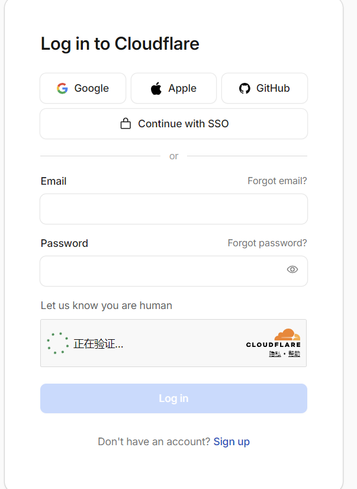

登录后可以设置中文

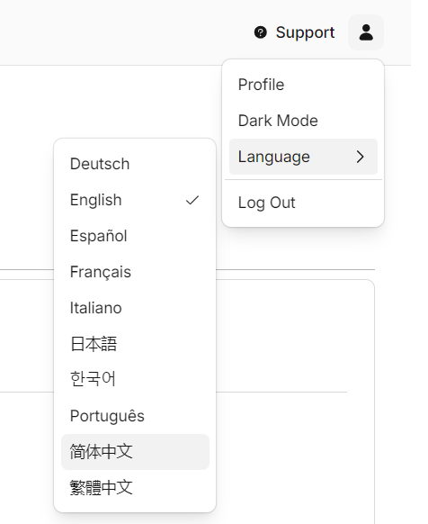

## 2、开通 Zero Trust

登录后，Cloudflare 管理后台 [Cloudflare Dashboard | Manage Your Account](https://dash.cloudflare.com/)， 点击左边 Zero Trust,然后点击 Get started！

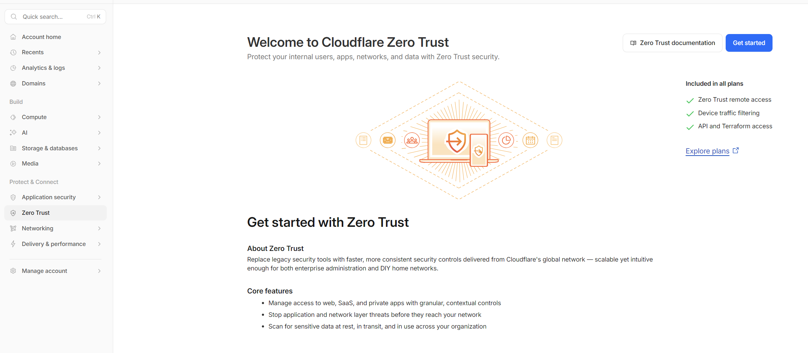

输入团队名称名称，可用即可！

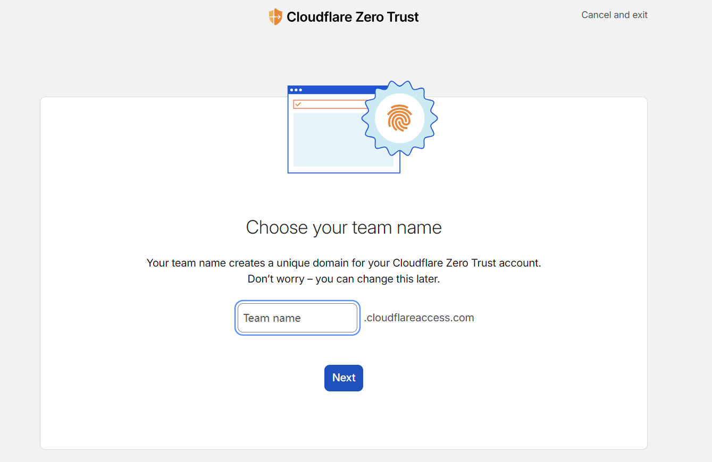

选 Free 的套餐，不需要绑定信用卡等，下一步跳过即可！

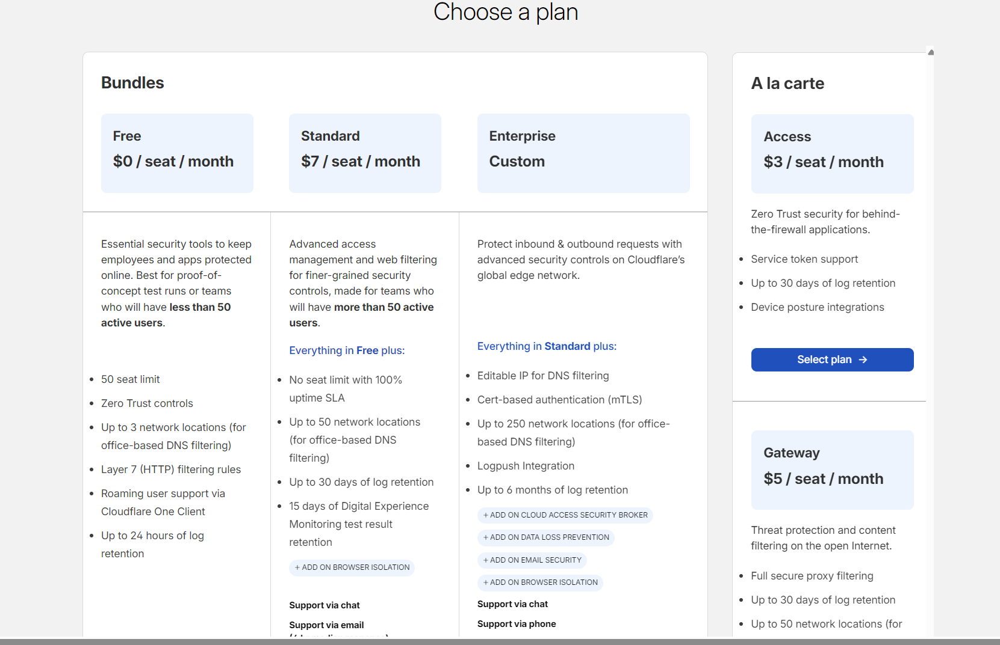

把地址栏后面的内容去掉，只保留 https://dash.cloudflare.com/ 时会回到首页，重新点击 Zero Trust！

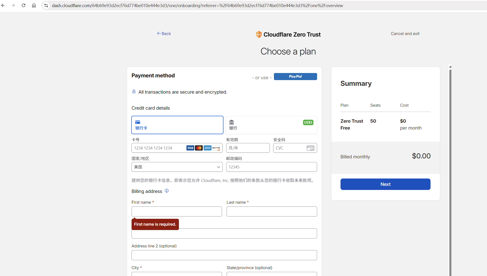

点击右边的团队和资源->设备。 添加设备。

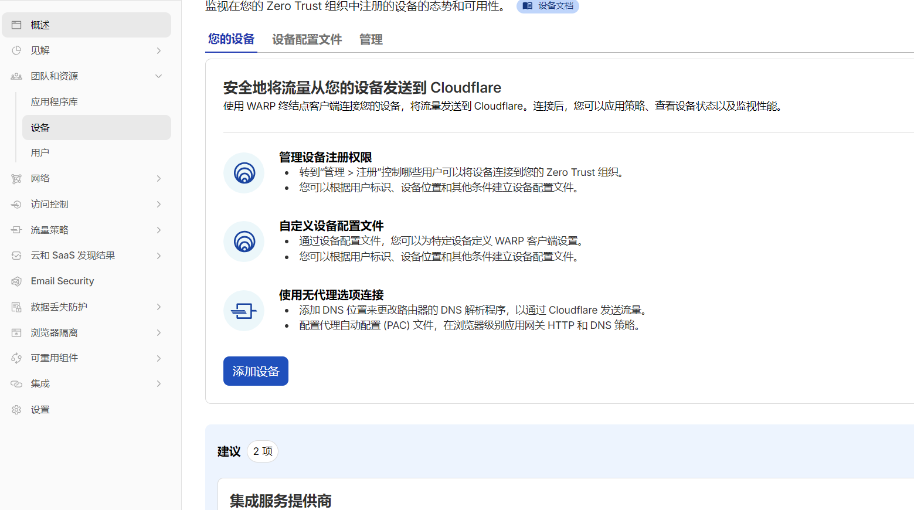

下载 Warp 软件，然后一直下一步即可！

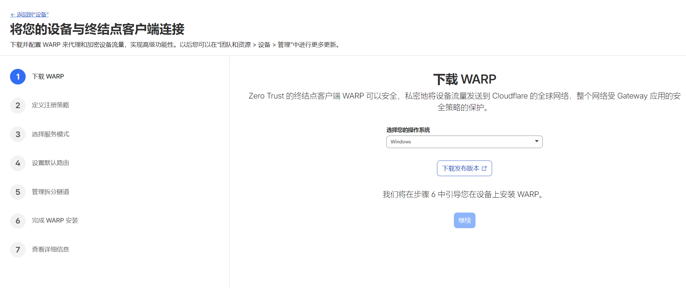

定义注册策略 是允许那些邮箱使用， 然后就是服务模式默认 流量和 DNS（推荐）！

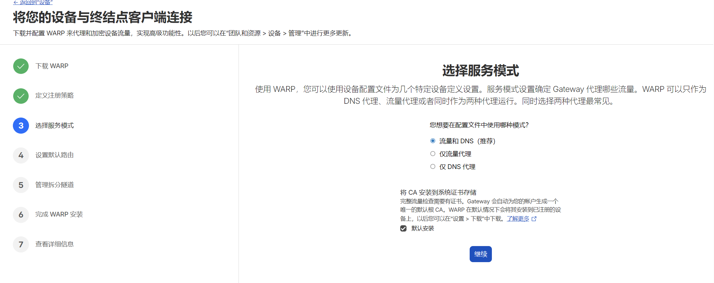

继续

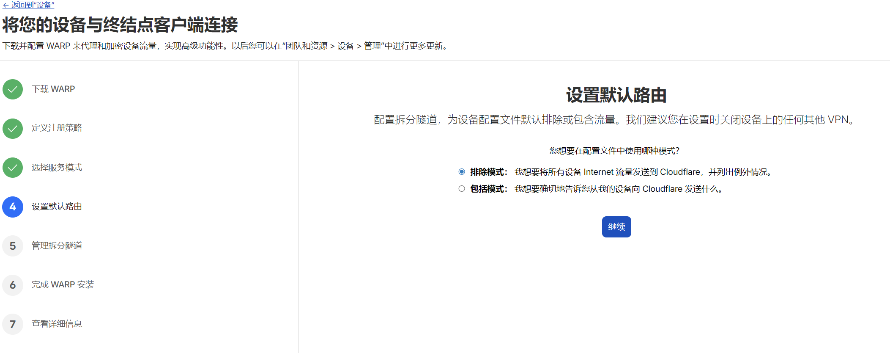

## 3、安装 Warp 软件

把前面下载的 Warp 安装好软件后，打开 。

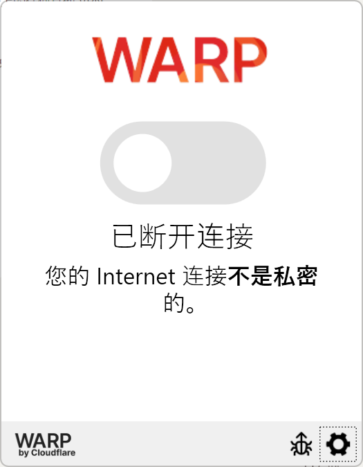

点右下角设置，偏好设置，点击右下角使用 cloudflare zero trust 登录

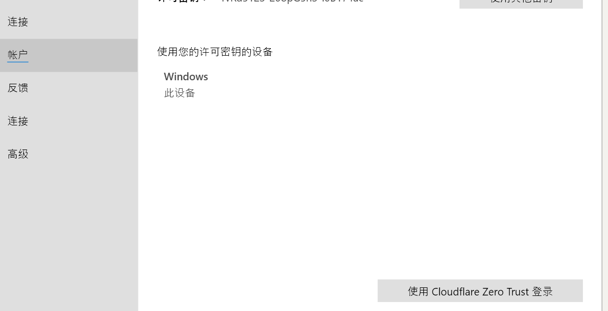

然后下一步

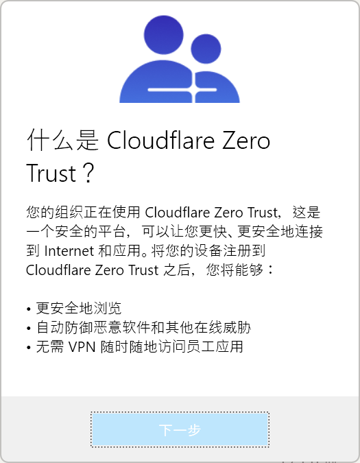

输入你的团队名字

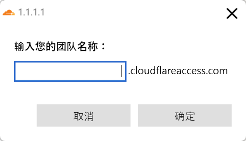

点击确定，会自动打开浏览器，输入前面填入的允许的邮箱！

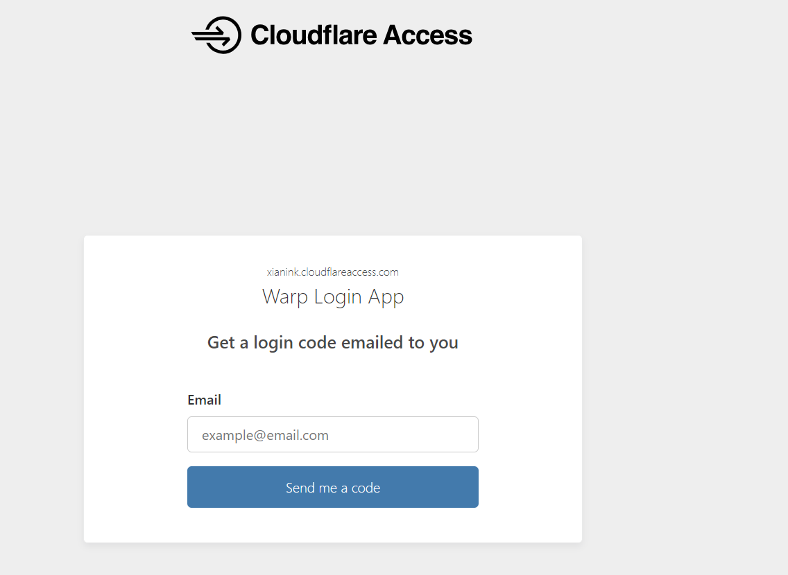

验证码输入后点 Sign in

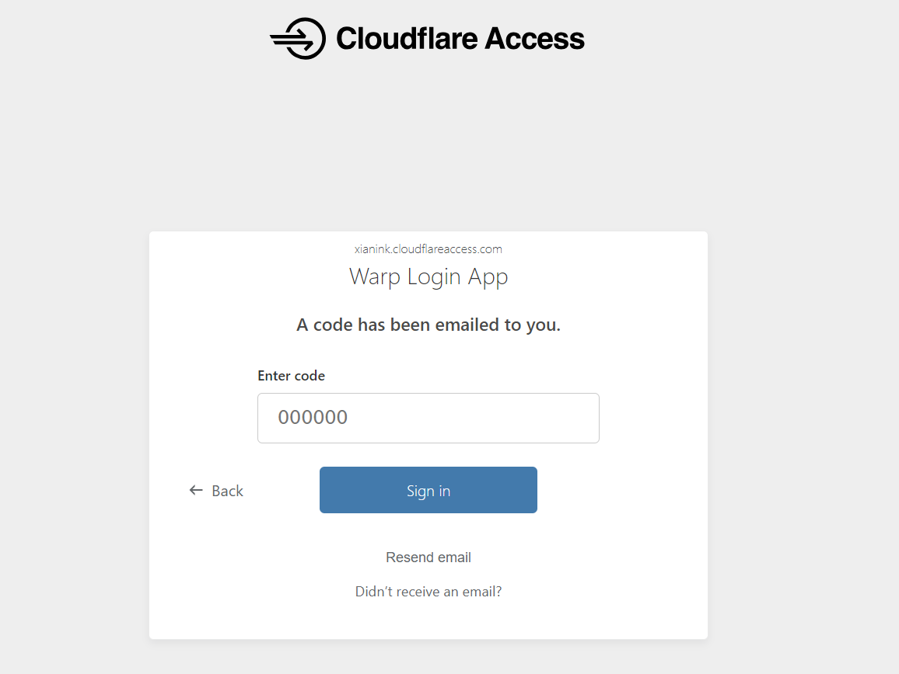

最后出现 Zero Trust 就是成了，点击开启连接。

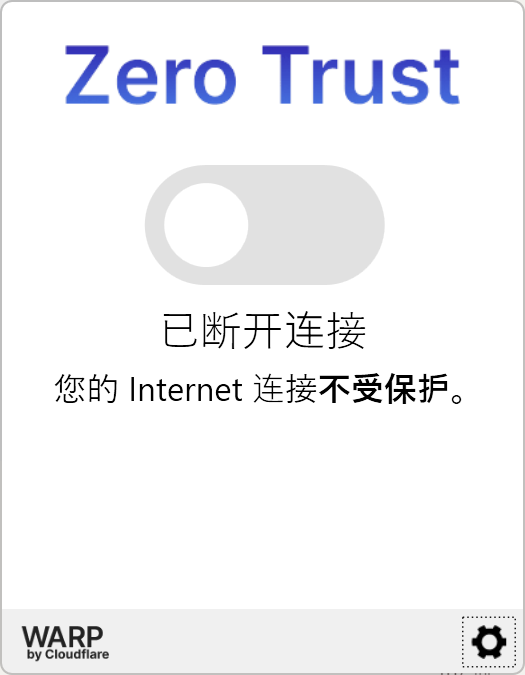

访问 Goole 试试。

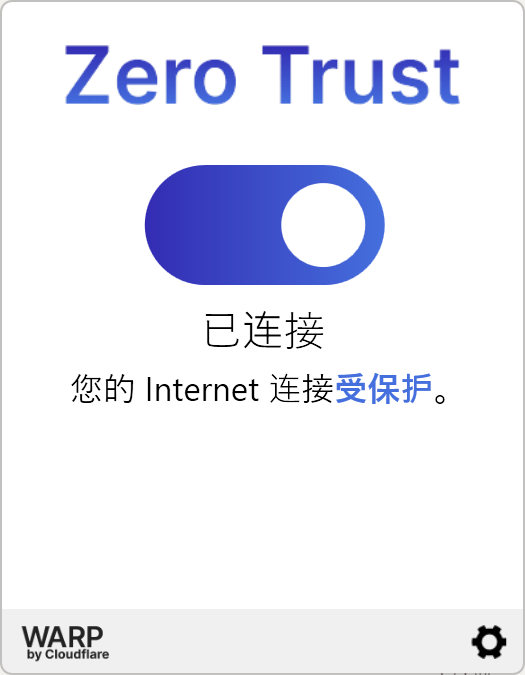

## 4、移动端安装

打开 Google Play 商店，下载 Cloudflare One Agent

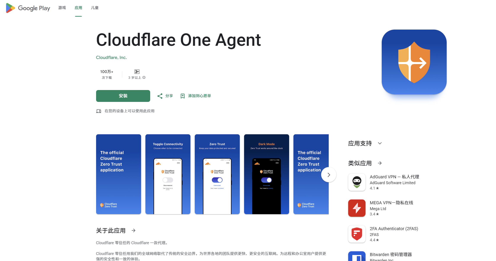

iOS 需要用美区的苹果账户
